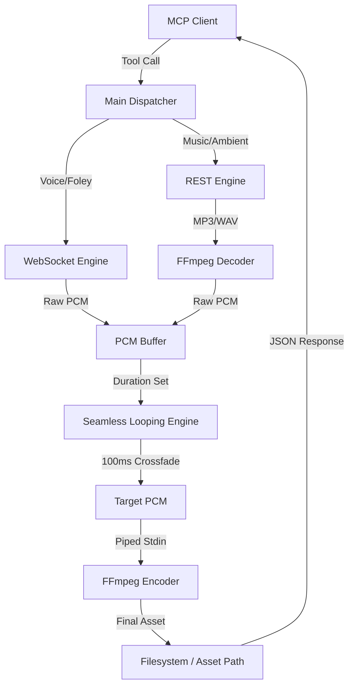

# 🏛 System Architecture: Gemini Audio MCP

This document outlines the high-level design and technical implementation of the Gemini Audio MCP server. The architecture is optimized for low-latency delivery and high-fidelity audio synthesis.

---

## 🏗 Component Overview

### 1. Hybrid Engine Strategy
The server bifurcates its generation logic based on the model's protocol requirements:

-   **WebSocket Engine (Live Audio)**:
    -   Connects to `models/gemini-2.5-flash-native-audio-latest` via a bidirectional WebSocket stream.
    -   **Use Case**: Real-time narration (`generate_voice`) and low-latency foley.
    -   **Logic**: Aggregates binary chunks of raw s16le PCM data into a unified buffer before post-processing.
-   **REST Engine (Production Synthesis)**:
    -   Interfaces with Google DeepMind's **Lyria 3** models via standard REST endpoints.
    -   **Use Case**: Environmental soundscapes (`generate_soundscape`) and musical compositions (`generate_music`).
    -   **Logic**: Handles base64 encoded payloads (MP3/WAV) and provides advanced controls for seed, guidance, and temperature.

### 2. Hybrid-Prompting Pipeline
To ensure "instrumental-only" results for soundscapes and adherence to musical theory, the server employs a multi-stage prompting strategy:

1.  **Metadata Injection**: The `bake_lyria_prompt` function programmatically injects BPM, Key, Intensity, and Vocal Profiles into the user's raw prompt.
2.  **Acoustic Restriction**: For `generate_soundscape` and `generate_sfx`, the server automatically appends aggressive negative constraints (e.g., `"NO VOCALS. NO SINGING. NO SPEECH."`) to prevent unwanted vocal artifacts common in generative audio models.
3.  **Multimodal Guidance**: If an `image_path` is provided, the server encodes the image to Base64 and merges it with the text prompt, allowing the model to "see" the environment it is synthesizing (e.g., guiding the reverb based on a picture of a cave).

### 3. Integrated PCM Processing Loop
A critical feature for environmental audio is the ability to generate "infinite" loops from finite model outputs.

**Process Flow (`decode -> loop -> encode`):**
1.  **Fetch**: The model returns a high-quality 30s-180s clip.
2.  **Decode**: The server uses `ffmpeg` pipes to decode the compressed stream back to raw, uncompressed s16le PCM samples.
3.  **Looping Logic**: The `audio::seamless_loop` engine calculates the necessary repetitions to meet the target `duration`.
4.  **Micro-Crossfades**: To eliminate audible clicks at loop points, the engine applies a **100ms linear crossfade** between the end of the previous iteration and the start of the next.
5.  **Encode**: The final PCM buffer is piped back into `ffmpeg` for high-performance encoding to the user's requested format (MP3, OGG, FLAC, etc.).

---

## 🔀 Data Flow Diagram

---

## 🛠 Transcoding & Universal Formats
The server abstracts complex FFmpeg commands into a simple `AudioOptions` interface. It supports a wide array of formats by mapping extensions to specific encoders:
-   `mp3`: `libmp3lame`
-   `ogg`: `libvorbis`
-   `flac`: native `flac` encoder
-   `opus`: `libopus`
-   `aac`: native `aac` encoder

---

## 📁 File Manifest
-   `src/main.rs`: Tool registration, JSON-RPC lifecycle, and prompt baking.
-   `src/gemini.rs`: Dual-protocol (WS/REST) client for Google AI APIs.
-   `src/audio.rs`: The heart of the audio pipeline; handles decoding, encoding, and the seamless looping engine.
-   `src/mixer.rs`: Implements sample-level crossfading algorithms for `transition_soundscape`.
-   `src/config.rs`: Persistent JSON storage for user-defined audio defaults.
